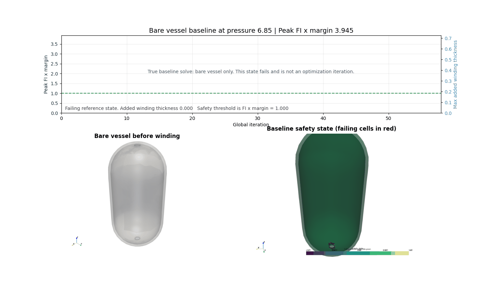

# COPV-JAXwinder

A design, simulation, and optimization tool for composite overwrapped pressure vessels (COPVs): differentiable winding optimization, ply-by-ply laminate analysis, and a browser-based CAE workflow application — all built on verified, open-source physics.



## Quick start — the workflow application

```bash
pip install -e .
python -m app.server
# open http://localhost:8081
```

A TaniqWind-Pro-style, left-to-right workflow: **Mandrel → Materials → Layers → Mesh → Analysis → Solve · Optimize → Winding → Results**. Define a tank by capacity or dimensions, choose an ellipsoidal or isotensoid dome, lay out a helical/hoop layer stack, run the real FEA and winding optimizer, and inspect the wound mandrel — fiber tows and layers rendered as actual coverage bands, not lines — with a switchable contour (failure index, per-mode Hashin, per-ply CLT, deformation, winding angle). The **Winding** step exports the optimized tow schedule (positions + orientations per course, JSON/CSV) and a CNC machine-motion summary.

This runs a real Python backend (JAX shell FEA + gmsh/OpenCASCADE mesh) behind a Three.js browser front end — see [`app/README.md`](app/README.md) for every entry point (headless CLI, one-shot pipeline, project catalog, Abaqus/CalculiX export, calibration to coupon data).

---

## What's inside

The repository has two layers:

1. **`src/copv_opt/`** — the physics kernel. Differentiable JAX shell FEA, classical laminate theory, netting analysis, filament-winding path/coverage/pattern physics, a machine post-processor, and a liner model for Type 3/4 vessels. Every kernel ships with a verification suite that checks it against closed-form or analytic references, not just internal self-consistency.
2. **`app/`** — the product layer: a workflow web application, a headless CLI, a one-shot design→simulation→optimization pipeline, and a legacy 8-phase production-readiness pipeline (below) built for an actual customer engagement.

### Verified physics kernels

| Module | What it does | Verified against |
|---|---|---|
| `physics.py` | CST shell FEA — assembles stiffness, solves CG, evaluates Hashin failure | Thin-cylinder membrane theory (hoop/axial ratio ≈ 2) |
| `clt.py` | Classical laminate theory — A/B/D matrices, per-ply stress recovery, per-ply Hashin | Symmetric-laminate B=0, cross-ply/angle-ply closed forms, quasi-isotropic invariants |
| `clt_fem.py` | Element-level per-ply CLT on the solved FEA mesh (critical ply + reserve factor per element) | Delegates to `clt.py`'s single-source Hashin criterion |
| `netting.py` | Classical fiber-only sizing — optimal helical angle, hoop/helical thickness split | atan(√2) = 54.7356° optimum; 1.5·p·r/σ invariant total fiber thickness |
| `liner.py` | Type 3/4 liner — isotropic-as-ply, von Mises yield, liner/overwrap load sharing | Thin-wall closed form (hoop = pr/t, von Mises = √3/2·pr/t) |
| `winding.py` | Geodesic + non-geodesic paths, coverage/pattern generation, isotensoid dome contour, dome thickness buildup | Clairaut invariant, coprime pattern closure, dome membrane-equilibrium ODE |
| `machine.py` | CNC winding post-processor — mandrel/carriage/eye-yaw axis motions | Round-trip path reconstruction to 1e-6 |
| `course_planner.py` | Continuous winding field → discrete helical pairs + hoop rings | Quantization RMSE + circumferential balance checks |

Run every fast suite at once:

```bash
python -m app.verify_all          # closed-form suites (CLT, liner, netting)
python -m app.verify_all --full   # + general-geometry FEA vs. the analytic COPV
python -m pytest tests -k "not shell_regression"   # ~40 unit tests, ~2s
```

### Geometry

Two dome families, both meshed with gmsh/OpenCASCADE and solved on the same verified shell FEA:

- **Ellipsoidal** (parametric) — `dome_height_ratio` controls the polar-to-equatorial axis ratio.
- **Isotensoid** — the netting-consistent membrane-equilibrium dome contour, integrated from the same physics as the netting sizing above.

An arbitrary axisymmetric meridian profile can also be screened directly (`app/meridian.py`, `engine.screen_profile`) — validated to ~1.6% against the analytic COPV on an identical mesh.

---

## Legacy pipeline: winding-first screening + production readiness

The original deliverable in this repo, still functional, and the origin of the physics kernel above. It narrows winding candidates to a structural design, converts that design to a discrete course plan, and runs an 8-phase production-readiness gate that names every input still missing for release.

1. **Finds the winding design with the lowest structural failure risk** for a given geometry and pressure, in minutes rather than the hours a full Ansys ACP setup takes. The result is a starting point for ACP verification, not a replacement for it.
2. **Converts that design to a discrete course plan** — the specific helical passes and hoop rings a winding machine would execute, not just a continuous angle field.
3. **Runs a production readiness checklist** across 8 phases (data contract → release gate) and names every missing input that blocks release. The output is always `do_not_release` until real machine, material, cure, inspection, and qualification data replaces the placeholders. That is intentional.

### Who reads what

| Role | Open this file | It answers |
|---|---|---|
| Production / quality engineer | `outputs/production_phase_execution/phase_execution_index.md` | Which phases are blocked and what data is missing |
| Simulation / structures engineer | `outputs/winding_first_summary.json`, winding plots in `outputs/` | Which winding angle and pass count to bring into ACP first |
| Manufacturing / process engineer | `outputs/winding_first_production_readiness.md` | Discrete course count, machine kinematic demand, missing process windows |
| Anyone evaluating the pipeline | `outputs/blackwave_demo_comparison.md` | How the phase results change when real line data is loaded |

### What a pipeline run looks like

The table below is real output from `outputs/blackwave_demo_comparison.md`. Left column is the pipeline with only public data (25 blockers). Right column is with a fully filled synthetic demo config (5 blockers). Both still end in `do_not_release` — because surrogate phases and absent qualification evidence correctly block release even when machine and process data are present.

| Phase | No line data (25 blockers) | Full demo data (5 blockers) |
|---|---|---|
| Data contract | gaps present | gaps present |
| Discrete course planning | ✓ computed | ✓ computed |
| Machine kinematics | demand only | ✓ screened against limits |
| Deposition physics | seed screen only | seed screen only |
| As-built surrogate | first-order only | first-order only |
| Cure / autofrettage | **blocked** — inputs absent | inputs ready |
| Inspection / digital thread | partial traceability | scaffold ready |
| Release decision | **do_not_release** | **do_not_release** |

Filling in the machine and process data closes phases 3, 6, and 7. The final release gate stays closed because qualification evidence (coupon, subcomponent, vessel data) is not present. That is the correct behaviour — the pipeline will not pretend that a structurally screened design is a qualified one.

To see this yourself:
```bash
pip install -e .
python generate_blackwave_target_outputs.py --config blackwave_dummy_line_config.json --output-dir outputs/blackwave_dummy_demo_execution
python generate_blackwave_demo_comparison.py
# Read: outputs/blackwave_demo_comparison.md
```

To load real line data, fill `blackwave_public_line_config_template.json` and re-run with that config. See `BLACKWAVE_VALUE_MAP.md` for priority fields.

### Where this sits in the workflow

```
This tool                         What comes after
──────────────────────────────    ──────────────────────────────────
Winding optimization (minutes)→   Ansys ACP: ply-by-ply verification
Narrows angle/pass candidates →   Physical DOE: fewer, better-aimed tests
Discrete course plan (JSON)   →   Machine post-processor: NC code
do_not_release gate + list    →   Production data fill: close the gaps
```

---

## Technical reference

### Shell element model

Structural screen uses CST triangle elements on a midsurface mesh (ellipsoidal or isotensoid dome). Curvature-coupled membrane strain and edge-level bending regularization handle the curved dome geometry.

The winding optimizer runs L-BFGS over 18 continuous controls: 6 meridional stations × (helical angle, helical pass count, hoop pass count).

### Reference results (ellipsoidal dome, parametric optimizer)

| | |
|---|---|
| Baseline FI (no overwrap) | 4021.3 |
| Optimized FI | 0.497 |
| Mass delta vs. baseline | +757% |
| Peak required friction | 0.1485 (effective optimizer limit: 0.1275, hard allowable: 0.15) |
| Burst factor | 1.418 |
| Dominant failure mode | Matrix tension |

**Baseline FI:** A 4-ply axial-only base laminate under 6.85 MPa gives hoop stress ≈ 548 MPa >> YT = 70 MPa. The overwrap is the structure; the high baseline confirms correct membrane stress computation.

**Mass delta:** The optimizer uses the full production-scale pass envelope (up to 44 helical, 24 hoop passes at 0.3 mm tow) to drive FI to 0.497. At +757%, the total wall is approximately 10.3 mm giving t/R ≈ 0.103, which is at the conventional thin-shell validity boundary (t/R < 0.1). Results at this wall fraction should be verified with a thick-shell or solid-element model before use in structural sizing. Downstream machine and build-time constraints are where the mass budget is tightened — not this screen.

### Physical context

**Clairaut friction limit.** When a tow is commanded along a non-geodesic path, it slides. The 0.15 friction allowable is the approximate boundary between stable deposition and lateral tow slip in wet-winding practice. An angle profile that violates it cannot be physically executed regardless of structural model output. The optimizer targets an effective limit of 0.1275 (85% of allowable) to ensure actual headroom. `winding.slippage_coefficient` computes the same k_g/k_n manufacturability ratio for an arbitrary non-geodesic path.

**Continuous field ≠ producible program.** The optimizer returns a structurally preferred continuous angle field. Closing the gap to a machine-executable program — discrete pass counts, cut-and-restart locations, handedness balance — is the job of the discrete course planner, and `machine.py` turns a course into mandrel/carriage/eye-yaw axis motions.

### Modules

| File | Purpose |
|---|---|
| `src/copv_opt/geometry.py` | Ellipsoidal dome shell. Arc-length parameterized meridian, midsurface mesh via gmsh. |
| `src/copv_opt/physics.py` | CST shell FEA. Assembles stiffness, solves CG, evaluates Hashin failure. |
| `src/copv_opt/config.py` | `GeometryConfig`, `MaterialConfig`, `FrictionConfig`, `WindingOptimizationConfig` dataclasses. |
| `src/copv_opt/optimize.py` | L-BFGS winding optimizer. FPP patch and hybrid winding+patch optimizers (thesis work). |
| `src/copv_opt/clt.py` | Classical laminate theory — A/B/D matrices, per-ply stress recovery and Hashin. |
| `src/copv_opt/clt_fem.py` | Element-level per-ply CLT on the solved shell mesh. |
| `src/copv_opt/netting.py` | Classical fiber-only netting sizing and burst-pressure estimate. |
| `src/copv_opt/liner.py` | Type 3/4 liner model — isotropic ply, von Mises yield, load sharing with the overwrap. |
| `src/copv_opt/winding.py` | Geodesic/non-geodesic paths, coverage, pattern search, isotensoid dome, machine-agnostic design summary. |
| `src/copv_opt/machine.py` | CNC winding post-processor: surface path → mandrel/carriage/eye-yaw axis motions. |
| `src/copv_opt/course_planner.py` | Converts continuous winding field to discrete helical pairs and hoop rings. |
| `src/copv_opt/production.py` | `ProductionLineConfig` dataclass hierarchy and gap reporting. |
| `src/copv_opt/production_pipeline.py` | 8-phase production readiness pipeline. |
| `src/copv_opt/abaqus_exporter.py` | Writes Abaqus `.inp` deck from optimized result. |
| `src/copv_opt/visualize.py` | PyVista and matplotlib rendering. Optional import. |
| `app/server.py` + `app/webapp/index.html` | The workflow web application (Three.js front end, JSON API backend). |
| `app/engine.py` | Product-layer engine: fast screen, full optimize, isotensoid screen, arbitrary-profile screen. |

Importing `copv_opt` or any pure-NumPy submodule (`clt`, `netting`, `winding`, `machine`, `liner`) does not pull in JAX, gmsh, or matplotlib — package exports are lazy (PEP 562).

### Running the legacy pipeline scripts

```bash
pip install -e .

# Run in order — each script consumes the previous script's outputs
python generate_winding_verification_outputs.py
python generate_production_program_outputs.py
python generate_full_production_phase_outputs.py

# Line-config pipeline (fill template with real data first)
python generate_blackwave_target_outputs.py --config blackwave_public_line_config_template.json --output-dir outputs/blackwave_target_execution
python generate_blackwave_target_outputs.py --config blackwave_dummy_line_config.json --output-dir outputs/blackwave_dummy_demo_execution
python generate_blackwave_demo_comparison.py
```

### Tests

```bash
python -m pytest tests -k "not shell_regression" -q   # 36 fast tests, no mesh, ~2s
python -m pytest tests -v                              # full suite incl. mesh-based regression (2-5 min)
```

Fast tests (`tests/test_clt.py`, `test_clt_fem.py`, `test_liner.py`, `test_netting.py`, `test_winding.py`, `test_machine.py`, `test_dome_nongeodesic.py`, `test_sizing.py`) check every physics kernel above against closed-form references with no mesh or JAX solve required. `tests/test_shell_regression.py` builds a fresh mesh and runs the full FEA solve — the 42° constant-angle case must clear FI < 0.75 at 8 mm band thickness.

CI (`.github/workflows/ci.yml`) runs the fast suite plus a syntax gate on the web app's JavaScript on every push.

### Material

T700/E862 UD ply at 60% fiber volume from **NASA/TM-2013-216574, Table 2**.

| Property | Value | Unit |
|---|---|---|
| E₁₁ | 139 067 | MPa |
| E₂₂ = E₃₃ | 7 908 | MPa |
| G₁₂ = G₁₃ | 3 206 | MPa |
| G₂₃ | 2 275 | MPa |
| ν₁₂ = ν₁₃ | 0.257 | — |
| ν₂₃ | 0.30 | — |

Hashin allowables (XT=2200, XC=1400, YT=70, YC=220, S=120 MPa) are literature values. Replace with coupon-derived allowables before production use — the web app's Materials step and `app/calibration.py` both accept custom allowables.

### Scope and limits

- The winding optimizer's geometry is fixed during optimization (dome shape and cylinder length are parameters, not design variables); the isotensoid dome and general-profile paths currently run a constant-angle screen rather than the full optimizer.
- Discrete course variables are not inside the optimizer — discretization is a downstream step.
- A Type 3/4 liner is modeled at the laminate-section (CLT) level with isotropic elastic-perfectly-plastic yield and load sharing with the overwrap; it is not yet coupled into the 3-D shell FEA solve or the winding optimizer.
- Cure, residual stress, and autofrettage are not coupled into the structural solve.
- Shell-element Hashin screen is a screening method, not a certified analysis approach — ACP + Mechanical with ply-by-ply draping is required for design verification.
- The CNC machine post-processor computes 3-axis (mandrel/carriage/eye-yaw) motion; a robotic post-processor and true collision detection need a specific machine/robot definition.
- `do_not_release` is the correct output until real machine, material, cure, inspection, and qualification data replace the null placeholders.
