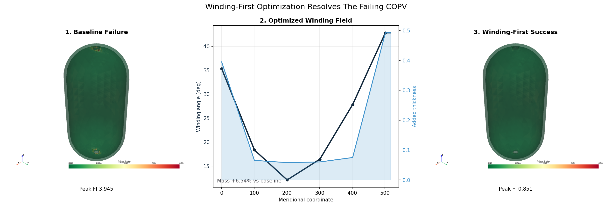
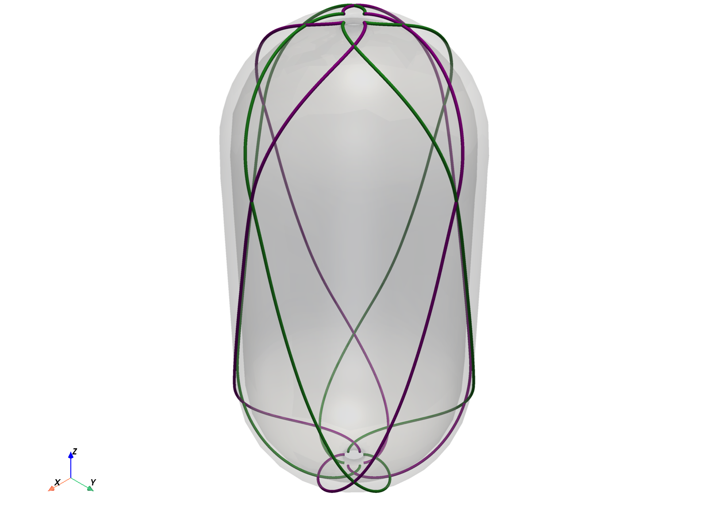

# COPV-JAXwinder: Differentiable Winding-First Optimization for Composite Pressure Vessels

COPV-JAXwinder is a fixed-geometry, JAX-based COPV screening engine. It optimizes winding process variables on an internal FEA model, keeps the staging branch focused on winding-only structural improvement, and exports accepted layups to Abaqus after the in-repo screen is complete.


## The Engineering Challenge

The repository is built around one question: how much failure can be removed by changing the winding field alone on a fixed COPV geometry?

On the packaged winding-first case in `outputs/winding_first_summary.json`, the refined boss mesh exposes a severe baseline hotspot. At `6.85` pressure, the unwound baseline vessel fails at a reported `FI = 3.945`. The optimized winding process reduces that to a reported `FI = 0.851` with `+6.54%` mass and a required friction coefficient of `0.0816`, still below the allowable `mu_max = 0.15`.

The physics kernel evaluates `failure_with_margin = failure_index * margin_of_safety`. The packaged winding-first artifact sets `margin_of_safety = 1.0`, so the reported `FI` in this README is the raw Hashin failure index for this case. An `FI` of `1.0` is exactly at the raw Hashin allowable, and the optimized result of `0.851` leaves the design at `85.1%` of that limit.

That is the validated story of the current branch: fixed geometry, winding-first design variables, internal JAX FEA, and an accepted design that clears the active Hashin limit.

## Visual Proof

The comparison matrix and GIF are generated from the packaged winding snapshots and VTU outputs. They show the failing baseline field, the added helical and hoop buildup, and the final safe design state from the actual accepted optimizer path.



## Geometry And Winding Physics

The current geometry is a cylindrical shell with hemispherical end caps and `10 mm` polar boss openings. The mesh is refined globally to `hmin = 10 mm`, `hmax = 28 mm`, with a local `4 mm` boss refinement zone inside a `28 mm` radius around each polar opening. That refinement is what exposes the boss-rim failure hotspot in the current verification outputs.

The geometry is fixed in the optimizer. Dome-profile optimization, autofrettage, residual-stress buildup, and full process simulation are not part of the current workflow.

More concretely, `run_winding_optimization()` solves for `18` continuous winding controls by default: `6` meridional control stations (`winding_ctrl_count = 6`) times `3` process parameters per station.

| Optimized process parameter | Internal field | Physical meaning | Default bounds |
| --- | --- | --- | --- |
| Helical winding angle profile | `winding_angle_ctrl` | Fiber angle relative to the local meridian, interpolated from pole to pole | `12-58 deg` |
| Helical pass-count / deposition profile | `helical_pass_ctrl` | Relative helical tow deposition at each station; converted to added thickness using `tow_thickness = 0.3 mm`, `tow_width = 12 mm`, `winding_family_count = 8`, and local vessel radius | `0-2` continuous passes |
| Hoop pass-count / deposition profile | `hoop_pass_ctrl` | Relative hoop tow deposition at each station; active mainly on the cylindrical section through a smooth hoop window | `0-2` continuous passes |

Those pass counts are continuous screening controls, not discrete machine-programmed whole passes. The optimizer objective balances structural failure, friction feasibility, mass, profile smoothness, and a local winding-thickness cap of `1.2 mm`. It does not optimize tow width, tow thickness, hoop transition length, friction limit, material properties, or vessel geometry unless those fixed configuration values are edited by hand.

The boss region also has a real physical helical exclusion zone. With the current mid-surface radius of `96 mm` and the allowed helical angle range of `12-58 deg`, the Clairaut minimum geodesic reach spans roughly `20.0-81.4 mm` from the vessel axis. The `10 mm` polar opening lies inside that exclusion zone for every helical family in the packaged run, and the hoop deposition window is concentrated on the cylindrical span and decays rapidly into the domes. That means the boss rim is carried by the base laminate thickness directly, while the optimizer reinforces the adjacent cylinder and transition zone. In the packaged winding-first result, the residual governing hotspot still sits near the far boss rim rather than in the reinforced cylindrical band.

## From Mathematics To Manufacturing

The solver pipeline is entirely in-repo until export:

- `geometry.py` builds or remeshes the fixed COPV shell and boss-refined tetra mesh.
- `physics.py` builds the FE state, solves the pressure response in JAX, and evaluates Hashin failure plus friction-based manufacturability.
- `optimize.py` optimizes the winding process variables on the fixed geometry and keeps a feasible accepted design across continuation stages.
- `abaqus_exporter.py` writes the accepted layup, including density, to an Abaqus shell deck for downstream validation.



This makes the repo useful as a structural screening and design-decision layer before detailed winding machine programming or higher-fidelity downstream validation.

## Quick Start API

```python
from copv_opt import (
    GeometryConfig,
    MaterialConfig,
    WindingOptimizationConfig,
    build_copv_fem_state,
    ensure_copv_mesh,
    export_result_to_abaqus,
    make_solve_compliance,
    run_winding_optimization,
)

geom = GeometryConfig(pressure=6.85)
material = MaterialConfig()
mesh = ensure_copv_mesh("outputs/copv_shell.step", "outputs/copv_shell.msh", geom)
state = build_copv_fem_state(mesh.nodes, mesh.elems, material, geom)
solve = make_solve_compliance(state)
winding = run_winding_optimization(
    state,
    material,
    WindingOptimizationConfig(max_winding_thickness=1.2),
    geom,
    solve,
)["result"]
export_result_to_abaqus(
    state,
    winding,
    geom,
    "outputs/optimized_copv_winding_first.inp",
    material=material,
)
```

## Reproduce The Packaged Outputs

```bash
pip install -e .
python generate_winding_verification_outputs.py
python generate_readme_assets.py
```

Primary staged artifacts:

- `outputs/winding_first_summary.json`
- `outputs/winding_optimization_snapshots.json`
- `outputs/optimization_evolution.gif`
- `outputs/winding_comparison_matrix.png`
- `outputs/pyvista_winding_first_layout.png`
- `outputs/optimized_copv_winding_first.inp`
- `outputs/copv_winding_first.vtu`

## Scope And Limits

- The committed cases are screening-grade verification runs on a tetrahedral surrogate, not certification analyses.
- The current failure check is Hashin-based structural screening, not a full progressive-damage or certification burst workflow.
- The workflow is fixed-geometry only. Dome/profile optimization, autofrettage, cure-induced residual stress, and winding machine kinematics are not yet modeled.
- The manufacturability check is a friction-based winding screen, not a full tow-overlap or path-planning simulation.
- Abaqus export is an optional handoff bridge into a higher-fidelity downstream workflow, not the optimization solver itself.
