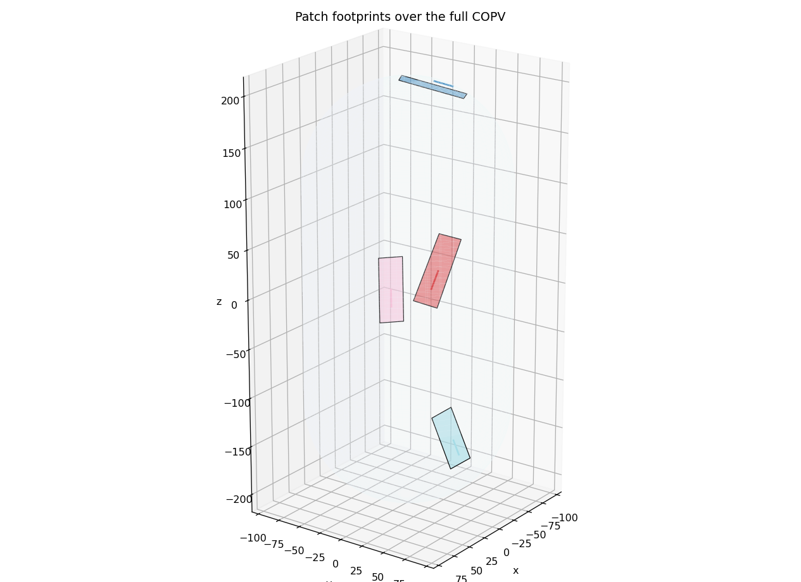
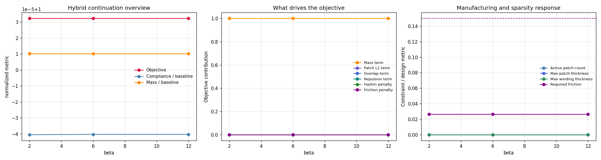
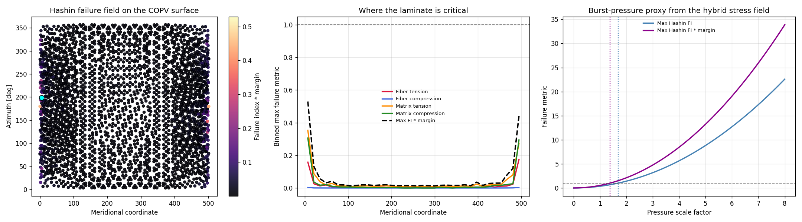
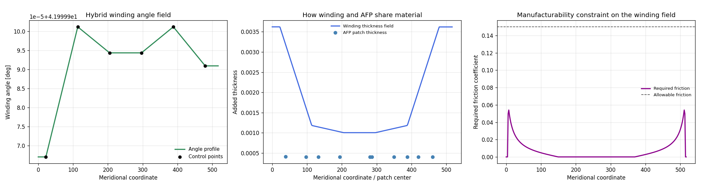
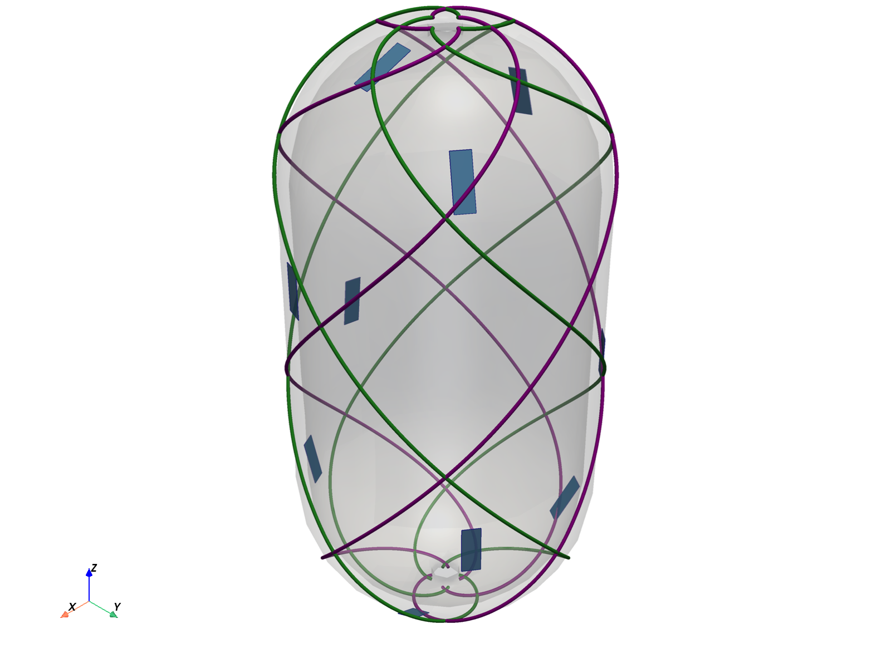
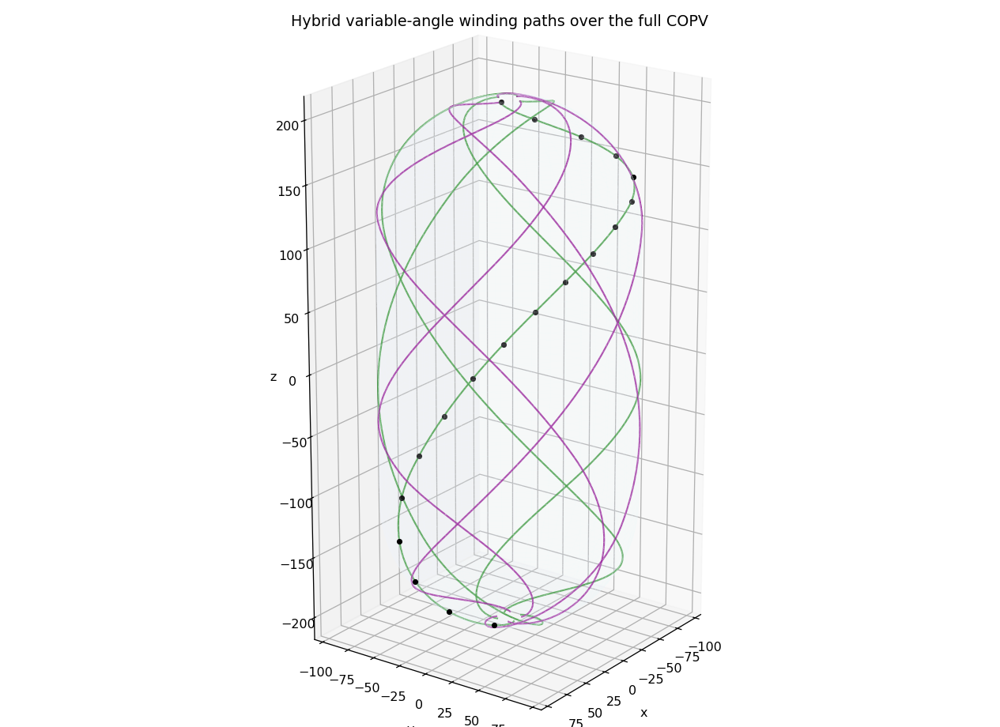

# COPV-JAXwinder

This repository is a hybrid COPV design engine for deciding when filament winding alone is sufficient and when localized AFP reinforcement is structurally justified. It sits upstream of detailed process definition: optimize a winding angle/thickness field and sparse AFP patch set on one COPV shell, screen the result against Hashin failure and winding manufacturability limits, then hand the accepted layup to Abaqus for downstream validation.

The workflow is designed to fit teams that already work with detailed winding software and FEA, including a Blackwave GmbH style stack built around TaniqWind Pro and Abaqus. It does not try to replace those tools. It reduces the number of candidates that ever need to reach them.

## Why This Matters For Blackwave

Before a new winding schedule reaches TaniqWind Pro, someone has to decide whether filament winding alone is sufficient or whether AFP reinforcement is actually needed. That decision usually means manual iteration between geometry, laminate assumptions, and downstream FEA. This repository turns that upstream screening problem into one gradient-based run on a single COPV shell surrogate, then hands the accepted winding-dominant or hybrid layup into the existing toolchain.

- It answers the upstream engineering question directly: does this vessel need AFP, or is filament winding already enough for the active load case?
- It is not a replacement for TaniqWind Pro or Abaqus. TaniqWind Pro remains the detailed winding environment, and Abaqus remains the downstream validation environment.
- It reduces the number of candidates that ever need to reach that downstream workflow by rejecting structurally weak or unbuildable winding schedules earlier.
- It exports artifacts that fit the existing workflow directly: VTU fields for inspection, JSON summaries for automation, and an Abaqus shell deck for FEA handoff.

## Core Capabilities

- **Hybrid FW + AFP co-optimization**: winding angle/thickness control points and AFP patch positions, orientations, and thicknesses are solved in one differentiable JAX optimization state.
- **Hashin-aware objective**: the hybrid branch minimizes added mass while penalizing laminate failure through a differentiable Hashin response.
- **Burst-pressure proxy**: the verification workflow scales the local hybrid stress field to estimate burst and margin-aware allowable pressure factors from the Hashin response.
- **Manufacturability penalty**: winding schedules that require more friction than the wet-winding limit are penalized before they ever reach downstream toolpath planning.
- **Abaqus bridge**: the optimized outer surface is exported as a shell deck with per-element orientations and composite shell sections.

## AFP-Needed Verification Case

The strongest proof in this repository is the committed AFP-needed case in `outputs/afp_activation/afp_case_summary.json`, regenerated by `generate_afp_activation_outputs.py`. This case raises the internal pressure to `6.85` and intentionally keeps the winding envelope tight: the added winding thickness is capped at `0.008`, and the winding angle field is limited to `40-44 deg`. That makes the question concrete: once the winding schedule is nearly fixed, can the optimizer decide that local AFP is necessary and place it where the vessel is actually failing?

| Metric | Baseline | Hybrid | Why it matters |
| --- | ---: | ---: | --- |
| Pressure | 6.85 | 6.85 | Same load case for both designs |
| Max Hashin FI | 1.078 | 0.978 | Hybrid brings the failing baseline back below the active limit |
| Strain energy | 789,558.1 | 750,484.6 | Local reinforcement also improves stiffness |
| Mass metric | 2,370,563.0 | 2,398,913.0 | Added mass stays targeted rather than global |
| Active AFP patches | 0 | 4 | The optimizer uses the available AFP budget instead of pruning it away |
| Patch thicknesses | - | 0.155, 0.092, 0.077, 0.076 | Four nontrivial patches remain in the final design |
| Max added winding thickness | 0.000 | 0.008 | The case is not solved by simply thickening the full winding field |
| Max required friction | - | 0.0159 | Still well below the allowable `mu_max = 0.15` |

This is intentionally not the unconstrained best-possible winding case. It is a constrained-winding screening case that asks the upstream manufacturing question directly: if the winding envelope is already mostly spoken for, does the optimizer know when AFP is actually needed? On this case, the answer is yes.



## No-AFP Verification Run

All numbers below come from the committed `outputs/hybrid_summary.json` regenerated by `generate_hybrid_verification_outputs.py` on the packaged solver path.

| Metric | Value | Why it matters |
| --- | ---: | --- |
| Mesh size | 899 nodes / 2696 tetrahedra | Coarse verification model used across the workflow |
| Objective value | 1.00003 | Constrained mass-oriented hybrid objective |
| Strain energy | 16,826.2 | Effectively unchanged from baseline for this load case |
| Mass metric | 2,370,587.0 | Only +0.001% above baseline |
| Max Hashin FI x margin | 0.0548 | Far below the active limit of 1.0 |
| Max required friction | 0.0264 | Well below the allowable `mu_max = 0.15` |
| Allowable pressure factor with margin | 4.271x | Margin-aware burst-pressure proxy |
| Estimated burst factor | 5.231x | Failure-envelope crossing from scaled Hashin response |
| Active AFP patches | 0 / 10 | Sparse optimizer pruned AFP from this load case |
| Dominant failure mode | Matrix tension | Current governing mode under the sample verification run |

The important result is not a compliance win. The important result is that the workflow can justify a **no-AFP decision** on this verification case. With the corrected screening material card and tighter hybrid convergence, the optimizer leaves the design essentially at baseline mass, stays comfortably within Hashin and friction limits, predicts substantial pressure margin, and exports a winding-dominant Abaqus deck. That is exactly the kind of upstream decision support a manufacturing team needs before committing AFP machine time.

The current dominant mode is **not** intended to imply that matrix tension governs COPVs in general. In this repository, the committed verification case is a unit-pressure screening run on a coarse Tet4 surrogate with a near-45 degree winding seed (`42 deg`). Under that combination, off-axis loading keeps the matrix-tension Hashin term highest. In pressure-scaled cases and winding angles pushed toward the classical `+-54.7 deg` netting optimum for hoop-dominated pressure loading, fiber tension is the expected governing COPV mode.

This workflow does not add reinforcement just because reinforcement is available. It adds reinforcement only when the constrained objective says it is necessary.

The default orthotropic elastic constants in `src/copv_opt/config.py` are representative **T700/E862** screening values rather than uncited placeholders. They are sourced from `NASA/TM-2013-216574`, Table 2, with transverse-isotropy assumptions used only where the source table does not provide out-of-plane Poisson terms.

## Primary Workflow Notebook

`notebooks/03_hybrid_verification.ipynb` is the main notebook in this repository. It verifies four things that matter in a production-oriented COPV design flow:

1. **Objective influence**: how much of the final decision comes from mass, AFP sparsity, Hashin penalty, and friction penalty.
2. **Failure on the geometry**: where the critical Hashin region sits on the COPV and which mode governs.
3. **Burst-pressure screening**: how the unit-pressure hybrid stress field scales to the first estimated failure crossing.
4. **Manufacturability and layout**: what winding field is selected, how much friction it requires, and what final hybrid layout is handed off.

## Output Visuals

| Objective influence | Hashin and burst proxy |
| :---: | :---: |
|  |  |

| Manufacturability | Hybrid explicit layout |
| :---: | :---: |
|  |  |

The winding field is also exported directly:



## How It Fits A Blackwave TaniqWind + Abaqus Workflow

1. Build the COPV shell, mesh, and pressure state.
2. Solve a hybrid winding + AFP design problem on the same geometry.
3. Reject candidates that violate Hashin or winding-friction limits.
4. Inspect the resulting fields in VTU and PNG outputs.
5. Export the accepted design to `optimized_copv_hybrid.inp` for Abaqus validation.
6. Use the winding-dominant or hybrid decision as upstream input to detailed process planning in TaniqWind Pro.

This repository is best understood as a **design-decision layer before detailed process definition**, not as a replacement for detailed winding software or final FEA.

## Quick Start

From the project root:

```bash
pip install -e .
```

No-AFP screening workflow:

```bash
python generate_hybrid_verification_outputs.py --skip-pyvista
```

AFP-needed verification workflow:

```bash
python generate_afp_activation_outputs.py
```

Notebook workflow:

```bash
jupyter lab notebooks/03_hybrid_verification.ipynb
```

If `pyvista` is installed, rerun the script without `--skip-pyvista` to refresh `outputs/pyvista_hybrid_explicit_layout.png` as well.

Key outputs from the hybrid verification workflow:

- `outputs/hybrid_summary.json`
- `outputs/copv_hybrid_jax.vtu`
- `outputs/optimized_copv_hybrid.inp`
- `outputs/hybrid_objective_influence.png`
- `outputs/hybrid_hashin_burst.png`
- `outputs/hybrid_manufacturing_constraints.png`
- `outputs/copv_hybrid_winding_paths.png`
- `outputs/pyvista_hybrid_explicit_layout.png`

Key outputs from the AFP-needed verification workflow:

- `outputs/afp_activation/afp_case_summary.json`
- `outputs/afp_activation/copv_base_failure.vtu`
- `outputs/afp_activation/copv_hybrid_afp_activation.vtu`
- `outputs/afp_activation/optimized_copv_hybrid_afp.inp`
- `outputs/afp_activation/afp_patch_projection.png`
- `outputs/afp_activation/afp_hashin_burst.png`
- `outputs/afp_activation/afp_manufacturing_constraints.png`

## Additional Manufacturing Comparison Notebook

`notebooks/02_jax_optimization.ipynb` remains in the repository as a separate manufacturing-family comparison notebook. On that compliance-only benchmark, standalone winding reduced compliance by 79.3%, discrete patches by 72.2%, and the continuous IFP surrogate by 53.9%.

That notebook is useful for comparing separate manufacturing families. The main repository workflow, however, is `03_hybrid_verification.ipynb`, because that is where added mass, failure screening, manufacturability limits, and Abaqus handoff are active together.

## Repository Layout

```text
COPV-JAXwinder/
|-- pyproject.toml
|-- README.md
|-- generate_afp_activation_outputs.py
|-- generate_hybrid_verification_outputs.py
|-- generate_pyvista_previews.py
|-- generate_readme_assets.py
|-- notebooks/
|   |-- 01_baseline_validation.ipynb
|   |-- 02_jax_optimization.ipynb
|   `-- 03_hybrid_verification.ipynb
|-- outputs/
`-- src/
    `-- copv_opt/
        |-- abaqus_exporter.py
        |-- __init__.py
        |-- config.py
        |-- geometry.py
        |-- physics.py
        |-- optimize.py
        `-- visualize.py
```

## Scope And Limitations

- The committed verification case is still a coarse tetrahedral shell surrogate under unit pressure, not a certification model.
- The JAX optimization runs directly on a CadQuery plus Gmsh Tet4 solid surrogate because that keeps the geometry-to-physics path simple and differentiable. The cost is that an `8 mm` wall is under-resolved relative to the `16-36 mm` element size, so through-thickness shell behavior is only screening-grade; the Abaqus shell deck remains the higher-fidelity downstream validation model.
- The burst-pressure result is a proxy based on pressure scaling of the local hybrid Hashin response, not a full nonlinear burst simulation.
- The manufacturability check is a friction-based screening model. It is now evaluated on interpolated meridional samples with extra dome coverage, but final tow stability in the dome transition should still be checked in TaniqWind Pro.
- The Abaqus exporter is a practical bridge into an existing FEA workflow, but the exported shell deck may still need downstream cleanup or refinement for production analysis.

## Next Verification Steps

- Add a second AFP-needed case with a different boss opening load path so the repository shows the same decision logic on more than one hotspot pattern.
- Replace the Tet4 surrogate with a midsurface shell formulation if the repository needs pressure-vessel-grade stress resolution inside the optimization loop.
- Swap the screening material and allowable defaults for a vessel-specific prepreg or wet-winding material card before using the workflow on a real program.

## Related Work

This repository is one part of a broader gradient-based structural optimization workflow:

- [Fiber Patch Placement](https://github.com/Tharun-arety/Fiber_Patch_Placement) - flat composite panel patch placement with stress-aware local reinforcement logic.
- [Coil Shape Optimizer](https://github.com/Tharun-arety/Coil-shape-optimizer) - JAX-based winding-pack geometry optimization for stellarator coils.

Across those projects, the common capability is the same: differentiable geometry and physics models used to make manufacturing and structural decisions before hardware is built.
